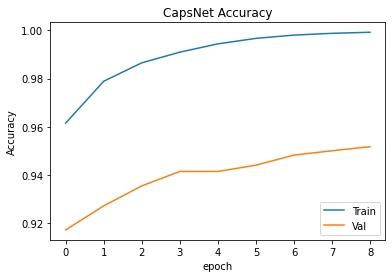

# Capsule Neural Network

[](https://colab.research.google.com/github/leopoldmaillard/CapsNet_kmnist/blob/main/capsnet_kmnist.ipynb)


By [Lucie Clair](https://github.com/LucieClair) & [Léopold Maillard](https://github.com/leopoldmaillard), as part of the INSA Rouen's Deep Learning course project, 2021.

This repository provides understanding, implementation and a detailed training process for NeurIPS 2017 paper [*"Dynamic Routing Between Capsules"*](https://arxiv.org/abs/1710.09829) by Geoffrey E. Hinton, Sara Sabour & Nicholas Frosst.

## About this work

### Motivation

### Dataset

The dataset chosen to illustrate our work is [Kuzushiji-MNIST](https://github.com/rois-codh/kmnist), which proposes a more challenging alternative to MNIST. Indeed, most of the recent Deep Learning models achieve more than 99.5% accuracy on MNIST, so it can be interesting to evaluate our model on more challenging datasets. K-MNIST consists of 70,000 images (28x28, grayscale) in 10 classes, one for each row of the Japanese Hiragana. 

Unlike other datasets like Fashion-MNIST, we haven't found any other implementations involving capsules on K-MNIST, and we will be thus able to compare our CapsNet results with benchmarked models. Finally, given the nature of the dataset, capsules seem **instinctively** particularly suitable for the task.

<div align="center">
  
</div>
<div align="center">Kuzushiji-MNIST 10 classes</div>


### Content 

This repositorty contains :
- A Capsule's original paper explanation and review in French.
- Kuzushiji-MNIST data (~20mb only).
- Capsule Layer and CapsNet TF2 implementation.
- An IPython Notebook for training the model (this can be executed in Google Colab).

## Implementation details

Unlike many Deep Learning models, there is no built-in functions in libraries like TensorFlow or Pytorch to sequentially build a CapsNet architecture. Thus, our model implementation relies on [Xifeng Guo's repository](https://github.com/XifengGuo/CapsNet-Keras) which provides the lower-level TensorFlow 2 code needed to build the model.

In particular, ```capsulelayers.py```provides the CapsuleLayer class. A Capsule Layer is similar to a Dense Layer, except that it outputs a **vector** instead of a scalar. This is also where the inner-loop for **routing** mechanism between capsules takes place. It basically ensures that a capsule sends its output vector to higher level capsule, taking into account how big the scalar product between the two vectors is. Finally, since the length of the output vector should represent the probability that the feature represented by the capsule is included in the input, Capsule Layer uses **squashing** activation so that short vector tends to 0-length and long vectors tends to 1-length.

In addition to the model itself, ```capsnet_kmnist.py``` contains the definition of the **margin loss** that ensures that the capsules for each Hiragana have a long instantiation vector if and only if the true label of the input corresponds to this symbol. Latter, this loss will be used alongside a reconstruction loss (Mean Square Error). Indeed, a decoder made of 3 dense fully-connected layers, takes as input the instanciation vector that outputs the Hiragana capsule in order to reconstruct the input image. The MSE between the actual image and the reconstructed one is then being minimized. Note that this additional loss is used as **regularization** and shouldn't take too much importance compared to the margin loss. It however helps the capsule to encode the instanciation parameters of the input Japanese symbol.

As in the paper, we will use the **Adam Optimizer** with its TensorFlow default parameters.

## Training Process

After preparing the data and building the model, we started training it. Training a CapsNet is challenging in several ways :
- It involves new **tunable hyper-parameters** (number of routing iterations, number of capsules, coefficient of the reconstruction loss used for regularization) in addition to the *traditionnal* hyper-parameters (learning rate, batch size, number of training epochs).
- CapsNet's numerous trainable parameters and routing mechanism (that adds a for-loop in the process) make it a model that **takes time** to train, even on low resolution images. Thus, training on GPU doesn't seem to be an option.

### A first attempt

As a first try, we started training the model for a few epochs using which seems *reasonable* values for each hyper-parameters. 

| Epochs | Routing iterations | Batch Size | LR decay | Decoder loss coef. | Data augmentation |
|:------:|:------------------:|:----------:|:--------:|:------------------:|:-----------------:|
|   10   |          3         |     100    |    0.9   |        0.392       |         no        |

Here is a plot of our results (accuracy plot begins at epoch 2 for better precision) :

  

- Training accuracy : 99.94%
- Validation accuracy : 95.17%

These are promising results. Indeed, we can see that the loss is correctly decreasing over time, which means that the model does learn from the training data. The model also generalizes new data but we can see that our main concern will be to deal with **overfitting** since there is a significant gap between the train and validation accuracies. Here are a few ideas in order to face this problem :

- Use data augmentation.
- Add dropout to the dense layers (although it hasn't been done in the original paper).
- Train on more epochs and use early stopping.

According to Hinton's paper, increasing the number of routing iterations seems to increase the network's trend to overfit, that's why we shall not change this hyper-parameter.

This training process took 13min/epoch to train on CPU, that's why we'll use CRIANN's ( Centre Régional Informatique et d'Applications Numériques de Normandie) computational power for further training.

### About CRIANN remote training set-up

#### Ressources

CRIANN gave us access to their GPU clusters in order to train our model on CUDA-enabled devices. Each node is equipped with up to 4 GPUs, 90gb of RAM and 40 CPU cores. Such configuration enabled us to adjust our parameters by launching several longer training phases.

#### Script submission

After establishing an SSH connection, we must submit a *job* by executing a SLURM script that specifies, in particular :
- the environment to load.
- the ressources to use (number of GPU(s), max training time...).
- the .py file to execute as well as a checkpoint directory to save the model's weights.

See ```training_script.sl```.

### Training iterations - hyperparameters tuning

We started by training the model for more epochs, while keeping the same hyperparameters. This enabled us to confirm our first intuition about overfitting.

| Epochs | Routing iterations | Batch Size | LR decay | Decoder loss coef. | Data augmentation |
|:------:|:------------------:|:----------:|:--------:|:------------------:|:-----------------:|
|   50   |          3         |     100    |    0.9   |        0.392       |         no        |

  

- Training accuracy : 99.99%
- Validation accuracy : 95.34%

#### Data augmentation

In order to improve the generalization ability of our model, we used data augmentation to synthetize more training data. Given the nature of the dataset, we had to consider carefully which transformations to perform. Indeed, *flipping* and *rotate* Japanese symbols wouldn't make much sense. However, we went with :
- Pixels shifting (this is performed in Hinton's paper on MNIST).
- Cutout (T. DeVries, 2017), which should help with regularization by randomly obfuscating regions of the training images.


## Results


## Entraînement du 11/04/2021

- Plus de 8 millions de paramètres entraînables, 13 min / epoch sur mon CPU.
- 80s / epoch sur un GPU Google Colab
- Sur 50 epochs, 3 rooting steps : Train Accuracy : 99.45%, Val Accuracy : 93.58
- What to do next :
  - Data augmentation (va aider pour l'overfit)
  - Dropout ?
  - Hyper-parameters tuning : n_routing, batch_size
  - Loss sur une trend descendante : entraîner sur + d'epoch
- Faire test sur le eval model
- Afficher les reconstructions

Explication d'Aurélien Géron : https://www.youtube.com/watch?v=pPN8d0E3900

Article Medium : https://towardsdatascience.com/capsule-networks-the-new-deep-learning-network-bd917e6818e8

